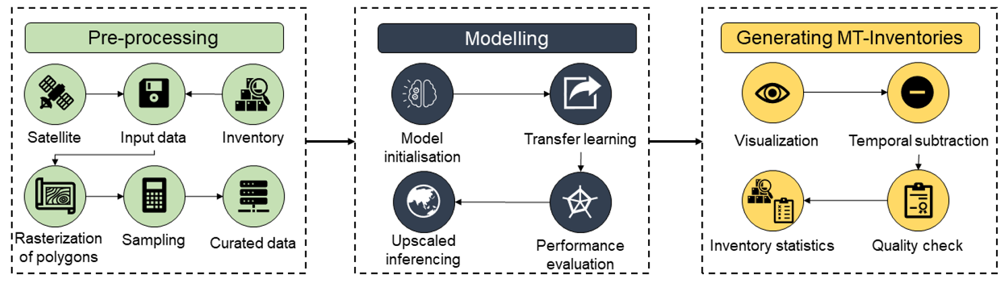

# A general deep transfer learning model for multi-temporal landslide mapping using HR EO data

### We introduce a novel cross-modal deep transfer learning strategy for deep learning that enables the Attention Deep Supervision Multi-scale U-Net model (ADSMS-UNet) to be customized for landslide detection tasks in different environments. By using the pre-trained models, this method enables quick mapping of landslides at various spatiotemporal scales. The technique also offers the adaptability of re-training a pretrained model to identify landslides caused by both rainfall and earthquakes on different target locations. We created multi-temporal landslide inventories for subsets of four regions hit by large earthquakes: (1) the 2008 Mw 7.9 Wenchuan, China, (2) the 2015 Mw 7.8 Gorkha, Nepal, (3) the 2016 Mw 7.8 Kaikōura, New Zealand, and (4) the 2018 Mw 7.5 Porgera, Papua New Guinea.

Contact mail: kushanavb@gmail.com & lorenava996@gmail.com

#### Schematic outlook

